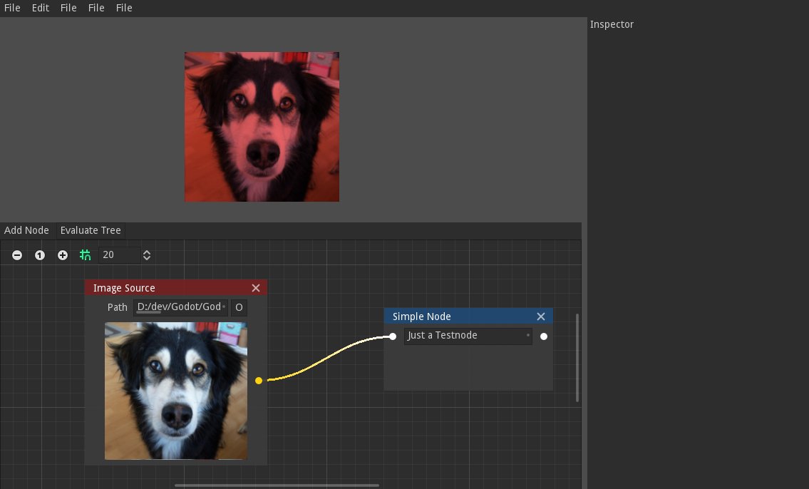

# GodotPhotoEdit

Aims to become a simple Photo Editor with a Filter Stack. Written in C# with Godot.

## Todo:
- Open and Save images UI
- Add and Remove Filters UI
- use Shaders for filters
- Filters need access to pixel position (example: Vignette → col multiplied by inverse distance to middle) - easier in GLSL than C# so wait for that.
- More Filters:
  - Vignette
  - Saturation

## Far off Ideas
- More Filters 
  - RGB Curves(UI ?))
  - Gausian Blur? Tilt Shift...
    - allows Bloom (Blur with lum Threshold)
- Masks
  - Mask drawing
- Overlay Images (Blendmode, Scale, Rot, Pos, Mask)
  - Blendmodes: Normal, Multiply, Add, Subtract, Divide, Overlay, Screen
- Procedural Textures
- Presets
- Batch Processing

